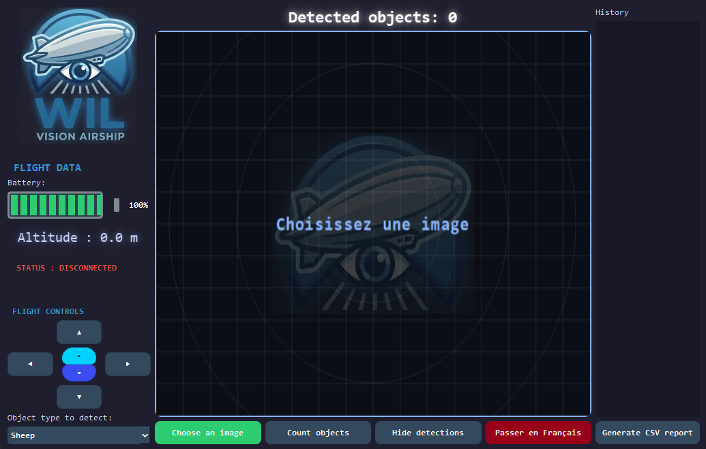
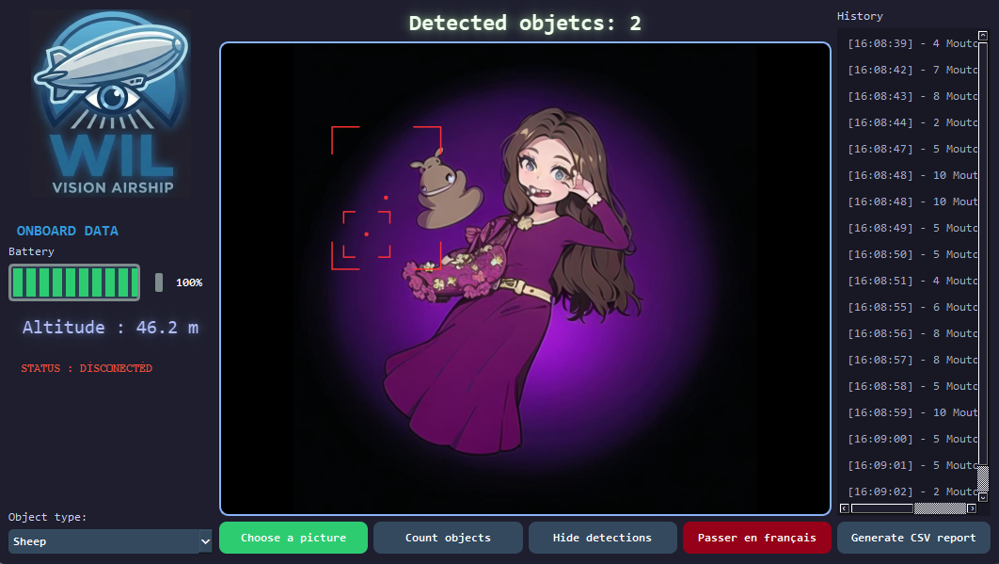

# 🛸 Project WIL - Ground Control Station


---

## 📝 Overview

The WIL Ground Control Station is a graphical interface developed in Python (PyQt6) designed for monitoring and analyzing images captured by a surveillance airship. The tool features an object detection system (sheep, cars, etc.) with automatic database archiving. This interface is available in English and French.

---

## 📸 Interface Preview

### Radar Mode (Standby)

<p align="center">
  
</p>

### Analysis & Detection (In development, currently using simulated detection)
<p align="center">
  
</p>

---

## 🎼 Key Features

**HUD Interface (Radar)** : Standby mode featuring a radar grid and a watermarked logo when no image is loaded.

- **Multi-Target Analysis** : Dropdown menu to select the type of object to detect (Sheep, Cars, Humans, Buildings).

- **Advanced Visualization** : Target marking using red corner brackets and a center point (centroid) for precise locking.

- **Animated Telemetry** : Altitude display with smooth transitions and a battery level indicator.

- **Data Management** : Integrated SQLite database for mission logs.

  - Automatic report export in CSV format.

  - Ability to reload previous captures from the history list.

- **Manual piloting**: Allows you to control the drone remotely by clicking on the interface or by using the arrow, shift and space keys.

---

## 🛠️ Installation

### Prerequisites :

- Python 3.11+
- PyQt6
- SQLite3 (built-in with Python)

### Étapes

1. Clone the repository :
    ```bash
    git clone https://github.com/SalmaMondon/Projet_WIL-Interface.git
    ```

2. Install dependencies :
   
    ```bash
    pip install PyQt6
    ```

    

3. Run the application :

    ```bash
    python main.py
    ```

---

## 🖥️ How to Use

1. **Loading** : Click on "**Choose a picture**" to import an aerial view.

2. **Configuration** : Select the object type from the **dropdown menu** on the left.

3. **Analysis** : Click on "**Count objects**" to launch the detection simulation.

4. **History** : Click on a row in the **history list** to review a past mission (altitude and detection boxes will update automatically).

5. **Report** : Generate a **CSV file** to extract flight statistics.

---

## 📂 Project Structure

- `main.py` : Main source code of the interface.

- `style.py`: QSS themes, neon cursors, and graphic effects.

- `database_manager.py`: SQLite database management and CSV exports.

- `config_manager.py`: Language saving and JSON settings.

- `utils..py`: Utility function and class.

- `projet_wil.db` : SQLite database (generated automatically).

- `assets/` : Contains logos and icons.

- `rapports/` : Output folder for CSV files.