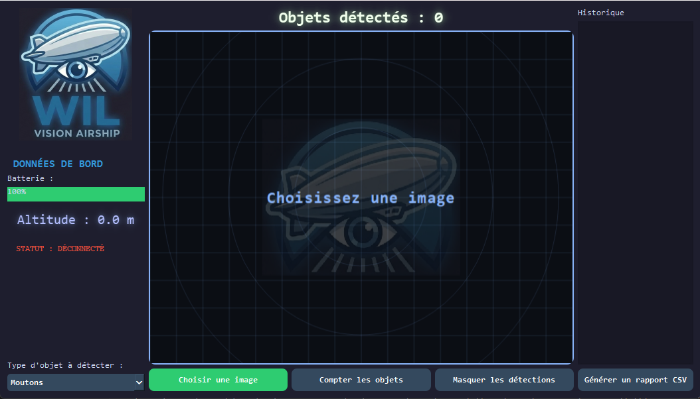
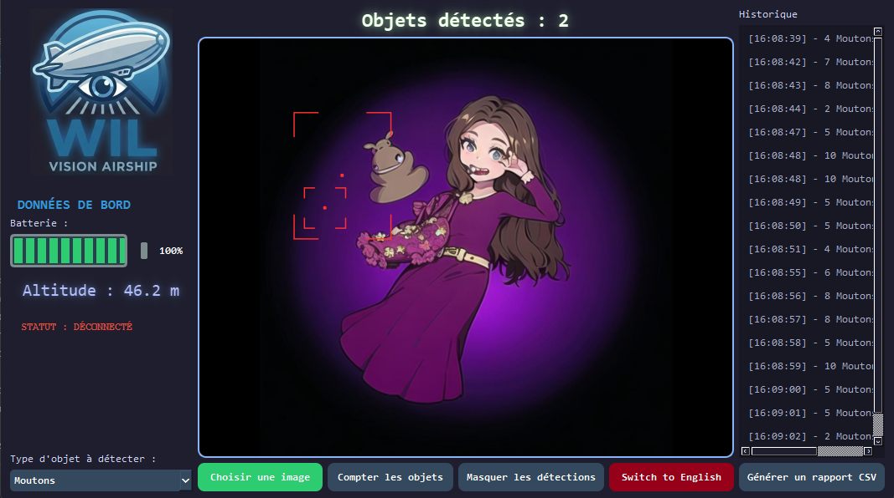

# 🛸 Projet WIL - Station de Contrôle au Sol


---

## 📝 Présentation 
La Station de Contrôle WIL est une interface graphique développée en Python (PyQt6) permettant le suivi et l'analyse d'images capturées par un dirigeable de surveillance. L'outil intègre un système de détection d'objets (moutons, voitures, etc.) avec archivage automatique en base de données.

---

## 📸 Aperçu de l'interface

### Mode Radar (Veille)
<p align="center">
  
</p>

### Analyse et Détection (en développement, détection aléatoire pour l'instant)
<p align="center">
  
</p>

---

## 🎼 Fonctionnalités clés
**Interface HUD (Radar)** : Mode veille avec grille radar et logo en filigrane lorsque aucune image n'est chargée.

- **Analyse Multi-Cibles** : Menu déroulant permettant de sélectionner le type d'objet à détecter (Moutons, Voitures, Humains, Bâtiments).

- **Visualisation Avancée** : Marquage des cibles par des coins rouges et un point central (centroid) pour un verrouillage précis.

- **Télémétrie Animée** : Affichage de l'altitude avec transition fluide et indicateur de niveau de batterie.

- **Gestion des Données** : Base de données SQLite intégrée pour l'historique des missions.

    - Exportation automatique des rapports au format CSV.

    - Rechargement d'anciennes captures depuis l'historique.

---

## 🛠️ Installation
### Prérequis :
- Python 3.10+
- PyQt6
- SQLite3 (inclus de base avec Python)

### Étapes
1. Clonez le dépôt :
    ```bash
    git clone https://github.com/SalmaMondon/Projet_WIL-Interface.git
    ```

2. Installez les dépendances :
    ```bash
    pip install PyQt6
    ```

    

3. Lancez l'application :
    ```bash
    python main.py
    ```

---

## 🖥️ Utilisation
1. **Chargement** : Cliquez sur "**Choisir une image**" pour importer une vue aérienne.

2. **Configuration** : Sélectionnez le type d'objet dans le **menu déroulant** à gauche.

3. **Analyse** : Cliquez sur "**Compter les objets**" pour lancer la simulation de détection.

4. **Historique** : Cliquez sur une ligne de l'**historique** pour revoir une ancienne mission (l'altitude et les boîtes de détection se mettront à jour).

5. **Rapport** : Générez un **fichier CSV** pour extraire les statistiques de vol.

---

## 📂 Structure du Projet
- `main.py` : Code source principal de l'interface.

- `projet_wil.db` : Base de données SQLite (générée automatiquement).

- `assets/` : Contient les logos  et les icônes.

- `rapports/` : Dossier de sortie des fichiers CSV.